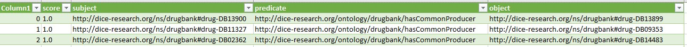

# Semantic Web Challenge 2019 (Task 1 – Fact Validation) [](https://colab.research.google.com/drive/1j1NQwvrYV21LnHtwz7izihyoB63fKaiw?usp=sharing)

> This is a machine learning algorithm that takes RDF triples as input and returns a trust score to evaluate the truth of the statement. 

## Table of Contents
* [General Info](#general-information)
* [Introduction](#introduction)
* [Technologies Used](#technologies-used)
* [Datasets](#datasets)
* [Algorithm](#algorithm)
* [Setup](#setup)
* [Usage](#usage)
* [Project Status](#project-status)
* [Acknowledgements](#acknowledgements)
<!-- * [License](#license) -->


## Introduction
The International Semantic Web Conference, to be held in Auckland in late October 2019, hosts an annual challenge that aims to promote the use of innovative and new approaches to creation and use of the Semantic Web. This year’s challenge will focus on knowledge graphs. Both public and privately owned, knowledge graphs are currently among the most prominent implementations of Semantic Web technologies. This year’s challenge is centered on validation of factual information in a newly generated Knowledge graph. The challenge is divided into two tasks:

* Task One: Fact Validation. Given a statement about an entity, e.g., the indication of a drug, participants are expected to provide an assessment about the correctness of the statement.
* Task Two: Fact Validation at Scale. In this task the participating systems will be evaluated for their scalability including runtime measurements and their ability to handle parallel requests.

Participants may choose to participate in one or both tasks. For both tasks, users may use a portion of the knowledge graph for training. The participants can make use of structured and unstructured information from Internet sources for validating facts. The evaluation of participating systems will be carried out on the testing portion of the Knowledge Graph owned by the organizers of the challenge.


## General Information
Task One: Fact Validation: 

The task is to validate triple statements i.e., to check if a given property holds for the subject and object entity. For this task, participants will create an algorithm that takes as input a given triple and returns a trust score. The challenge participants are expected to provide a trust score for each of the statements (i.e., a numerical value between 0 and 1), where 0 means that they are sure that the statement is false and 1 means that they are sure the statement is true. As mentioned above, to facilitate training, the participants will be provided with the training part of the dataset consisting of positive and negative statements. The positive and negative statements are labeled with trust scores 1 and 0, respectively. An example graph of an input triple in the training set is as follows:
```
<http://swc2019.dice-research.org/task/dataset/s-00001> <http://www.w3.org/1999/02/22-rdf-syntax-ns#type> http://www.w3.org/1999/02/22-rdf-syntax-ns#Statement> .
<http://swc2019.dice-research.org/task/dataset/s-00001> <http://www.w3.org/1999/02/22-rdf-syntax-ns#subject> <http://dice-research.org/ns/drugbank#drug-DB00001> .
<http://swc2019.dice-research.org/task/dataset/s-00001> <http://www.w3.org/1999/02/22-rdf-syntax-ns#predicate> <http://dice-research.org/ontology/drugbank/interactsWith> .
<http://swc2019.dice-research.org/task/dataset/s-00001> <http://www.w3.org/1999/02/22-rdf-syntax-ns#object> <http://dice-research.org/ns/drugbank#drug-DB09075> .
<http://dice-research.org/ns/drugbank#drug-DB00001> <http://www.w3.org/1999/02/22-rdf-syntax-ns#label> "Lepirudin"@en .                                                           
<http://dice-research.org/ns/drugbank#drug-DB09075> <http://www.w3.org/1999/02/22-rdf-syntax-ns#label> "Edoxaban"@en .                                                           
<http://swc2019.dice-research.org/task/dataset/s-00001> <http://swc2017.aksw.org/hasTruthValue> "0.0"^^<http://www.w3.org/2001/XMLSchema#double> .
```
Note that, the statements in the training set are labeled with trust scores 0 or 1 using the property <http://swc2017.aksw.org/hasTruthValue>. It is up to the participants to further split the training set into training and validation sets accordingly. The following properties will be used in scoring the systems:
 - http://dice-research.org/ontology/drugbank/interactsWith
 - http://dice-research.org/ontology/drugbank/hasCommonIndication
 - http://dice-research.org/ontology/drugbank/hasSameState
 - http://dice-research.org/ontology/drugbank/hasIndication
 - http://dice-research.org/ontology/drugbank/hasCommonProducer

The domain and range information and the descriptions of the above mentioned properties will be made available with the training set.


## Technologies Used
- Python3
- RDFlib
- scikit-learn
- numpy
- pandas

## Datasets
The algorithm works on two data sets, training and test. Both datasets contain statements about drugs and diseases.  The training set includes RDF triples with a 0/1 rating to determine whether the statement is true. 

```
<http://swc2019.dice-research.org/task/dataset/s-03755> <http://swc2017.aksw.org/hasTruthValue> "0.0"^^<http://www.w3.org/2001/XMLSchema#double> .
<http://swc2019.dice-research.org/task/dataset/s-03755> <http://www.w3.org/1999/02/22-rdf-syntax-ns#object> <http://dice-research.org/ns/drugbank#drug-DB02100> .
<http://swc2019.dice-research.org/task/dataset/s-03755> <http://www.w3.org/1999/02/22-rdf-syntax-ns#predicate> <http://dice-research.org/ontology/drugbank/hasCommonProducer> .
<http://swc2019.dice-research.org/task/dataset/s-03755> <http://www.w3.org/1999/02/22-rdf-syntax-ns#subject> <http://dice-research.org/ns/drugbank#drug-DB07860> .
<http://swc2019.dice-research.org/task/dataset/s-03755> <http://www.w3.org/1999/02/22-rdf-syntax-ns#type> <http://www.w3.org/1999/02/22-rdf-syntax-ns#Statement> .
<http://swc2019.dice-research.org/task/dataset/s-02272> <http://swc2017.aksw.org/hasTruthValue> "1.0"^^<http://www.w3.org/2001/XMLSchema#double> .
<http://swc2019.dice-research.org/task/dataset/s-02272> <http://www.w3.org/1999/02/22-rdf-syntax-ns#object> <http://dice-research.org/ns/drugbank#drug-DB11089> .
<http://swc2019.dice-research.org/task/dataset/s-02272> <http://www.w3.org/1999/02/22-rdf-syntax-ns#predicate> <http://dice-research.org/ontology/drugbank/hasCommonProducer> .
<http://swc2019.dice-research.org/task/dataset/s-02272> <http://www.w3.org/1999/02/22-rdf-syntax-ns#subject> <http://dice-research.org/ns/drugbank#drug-DB11365> .
<http://swc2019.dice-research.org/task/dataset/s-02272> <http://www.w3.org/1999/02/22-rdf-syntax-ns#type> <http://www.w3.org/1999/02/22-rdf-syntax-ns#Statement> .
<http://swc2019.dice-research.org/task/dataset/s-02059> <http://swc2017.aksw.org/hasTruthValue> "1.0"^^<http://www.w3.org/2001/XMLSchema#double> .
<http://swc2019.dice-research.org/task/dataset/s-02059> <http://www.w3.org/1999/02/22-rdf-syntax-ns#object> <http://dice-research.org/ns/drugbank#drug-DB13879> .
<http://swc2019.dice-research.org/task/dataset/s-02059> <http://www.w3.org/1999/02/22-rdf-syntax-ns#predicate> <http://dice-research.org/ontology/drugbank/hasCommonProducer> .
<http://swc2019.dice-research.org/task/dataset/s-02059> <http://www.w3.org/1999/02/22-rdf-syntax-ns#subject> <http://dice-research.org/ns/drugbank#drug-DB13878> .
<http://swc2019.dice-research.org/task/dataset/s-02059> <http://www.w3.org/1999/02/22-rdf-syntax-ns#type> <http://www.w3.org/1999/02/22-rdf-syntax-ns#Statement> .
```

The training set is similar except that it does not include the trust score.

```
<http://swc2019.dice-research.org/task/dataset/s-03755> <http://swc2017.aksw.org/hasTruthValue> "0.0"^^<http://www.w3.org/2001/XMLSchema#double> .
<http://swc2019.dice-research.org/task/dataset/s-03755> <http://www.w3.org/1999/02/22-rdf-syntax-ns#object> <http://dice-research.org/ns/drugbank#drug-DB02100> .
<http://swc2019.dice-research.org/task/dataset/s-03755> <http://www.w3.org/1999/02/22-rdf-syntax-ns#predicate> <http://dice-research.org/ontology/drugbank/hasCommonProducer> .
<http://swc2019.dice-research.org/task/dataset/s-03755> <http://www.w3.org/1999/02/22-rdf-syntax-ns#subject> <http://dice-research.org/ns/drugbank#drug-DB07860> .
<http://swc2019.dice-research.org/task/dataset/s-03755> <http://www.w3.org/1999/02/22-rdf-syntax-ns#type> <http://www.w3.org/1999/02/22-rdf-syntax-ns#Statement> .
<http://swc2019.dice-research.org/task/dataset/s-02272> <http://swc2017.aksw.org/hasTruthValue> "1.0"^^<http://www.w3.org/2001/XMLSchema#double> .
<http://swc2019.dice-research.org/task/dataset/s-02272> <http://www.w3.org/1999/02/22-rdf-syntax-ns#object> <http://dice-research.org/ns/drugbank#drug-DB11089> .
<http://swc2019.dice-research.org/task/dataset/s-02272> <http://www.w3.org/1999/02/22-rdf-syntax-ns#predicate> <http://dice-research.org/ontology/drugbank/hasCommonProducer> .
<http://swc2019.dice-research.org/task/dataset/s-02272> <http://www.w3.org/1999/02/22-rdf-syntax-ns#subject> <http://dice-research.org/ns/drugbank#drug-DB11365> .
<http://swc2019.dice-research.org/task/dataset/s-02272> <http://www.w3.org/1999/02/22-rdf-syntax-ns#type> <http://www.w3.org/1999/02/22-rdf-syntax-ns#Statement> .
<http://swc2019.dice-research.org/task/dataset/s-02059> <http://swc2017.aksw.org/hasTruthValue> "1.0"^^<http://www.w3.org/2001/XMLSchema#double> .
<http://swc2019.dice-research.org/task/dataset/s-02059> <http://www.w3.org/1999/02/22-rdf-syntax-ns#object> <http://dice-research.org/ns/drugbank#drug-DB13879> .
<http://swc2019.dice-research.org/task/dataset/s-02059> <http://www.w3.org/1999/02/22-rdf-syntax-ns#predicate> <http://dice-research.org/ontology/drugbank/hasCommonProducer> .
<http://swc2019.dice-research.org/task/dataset/s-02059> <http://www.w3.org/1999/02/22-rdf-syntax-ns#subject> <http://dice-research.org/ns/drugbank#drug-DB13878> .
<http://swc2019.dice-research.org/task/dataset/s-02059> <http://www.w3.org/1999/02/22-rdf-syntax-ns#type> <http://www.w3.org/1999/02/22-rdf-syntax-ns#Statement> .
```

## Algorithm
First, SWC_2019_Train.nt (turtle format) is loaded as a graph. We iterate through the graph and create a dataframe with statement, subject, object, predicate and score columns. The output file looks like train.csv (column1 was added when converting to dataframe)




## Setup
All requirements are placed in the requirements.txt file in the main repository folder.

To install, use the command:

`pip install -r requirements.txt`


## Usage
To run project simply enter this command while in repo root folder:

`python main.py`


## Project Status
Project is:  _complete_.


## Acknowledgements
- Thank you for the opportunity to learn something new
- Many thanks to... Dr.Bąk
